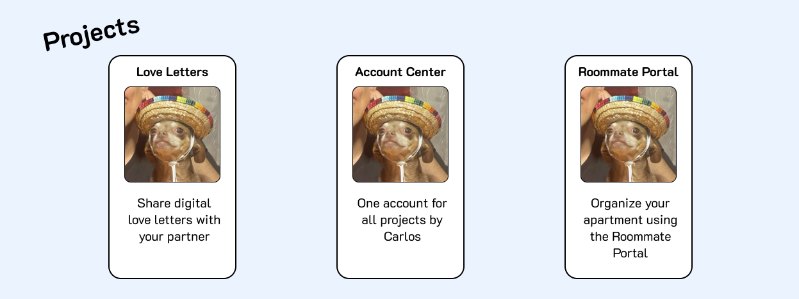

# Project Status Tracker
## Introduction
I tend to have a lot of projects that I forget about, want to status update, or simply want to showcase on my 
[main page](https://cvaldez.dev/) without having to edit the HTML code. I wish I could remotely edit this somehow... 
oh wait.

## Project Status Tracker
The Project Status Tracker, or "the tracker" for short, would be a web app where it would help me visualize what 
projects I'm working on and outline future ones. This would also help other people by providing updates as to what I've 
been working on, as well as the process of my work.

## Development
This would, ideally, be a full on web app with a dedicated page (I'm thinking `https://cvaldez.dev/track/`?), an API, 
and integration throughout the website. 
The tracker would have URLs that would clearly showcase which project it's tracking, such as 
`.../track/ASPECT/APP/`. The URLs, in a sense, would be a sentence. "Track overview (of) Access."

The `ASPECT` part would, ideally, be replaced by:
- `overview`: The general overview of the project
- `updates`: Project update release notes
- `requirements`: The requirements for the app
- `design`: The design of the project, showcasing my Figma files
- `development`: The coding of the project, showcasing GitHub repos

The `APP` part would, ideally, be replaced by the app's "homepage URL". For example, if Access' homepage is `/access/`, 
then it's tracker URL would be `/track/overview/access/`. 

The status of the project would be displayed in `overview`, with the following status indicators:
- `researching` (interviews, setting requirements...)
- `designing`
- `developing`
- `maintaining`

## Concept
The idea for this came from a design I made meant for displaying my web apps on my home page. Here's the concept:

